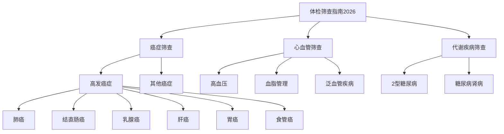

# 体检筛查指南2026知识库

> 基于中国各类疾病筛查与防治指南/专家共识整理，涵盖癌症、心血管疾病、糖尿病等常见疾病的筛查方案与预防建议。

## 目录

### 一、总览与统计
- [[01-中国恶性肿瘤流行概况]] — 2022年中国癌症发病与死亡数据
- [[02-健康体检基本项目专家共识]] — 体检项目设计框架
- [[03-居民常见恶性肿瘤筛查推荐2025]] — 24个瘤种筛查与预防推荐
- [[04-成人个体化健康体检项目推荐]] — 个体化体检"1+X"框架与慢性病筛查清单
- [[07-肿瘤预防与健康管理]] — 三级预防体系、风险因素干预、各癌种筛查推荐汇总

### 二、各癌种筛查指南
- [[乳腺癌筛查指南]]
- [[肺癌筛查指南]]
- [[结直肠癌筛查指南]]
- [[胃癌筛查指南]]
- [[肝癌筛查指南]]
- [[食管癌筛查指南]]
- [[前列腺癌筛查指南]]
- [[卵巢癌筛查指南]]
- [[宫颈癌筛查指南]]
- [[甲状腺癌筛查指南]]
- [[胰腺癌筛查指南]]
- [[膀胱癌筛查指南]]

### 三、心血管与代谢疾病
- [[心血管疾病筛查与管理指南]]
- [[糖尿病防治指南]]

### 四、前沿技术与专题
- [[06-肿瘤DNA甲基化标志物检测]] — 甲基化检测技术、样本规范、临床应用全流程
- [[05-基于液体活检的多癌种联合筛查]] — MCED技术原理、标志物路线、临床效用评估
- [[前沿技术与专题]] — 四项前沿技术的快速概览（含产品实践参考）

### 五、体检方案运营数据
- [[08-体检筛查项目价格参考]] — 三甲医院/体检机构各项目参考价、套餐合计区间（运营数据，以机构报价为准）

### 六、遗传性高危基因证据
- [[09-遗传性高危基因证据]] — Lynch(MMR)→结直肠/胃 OR、BRCA核对（纳入癌症概率，evidence_store_v14）

---

> 数据来源：中国国家癌症中心、中华医学会、中国抗癌协会等权威机构发布的指南与专家共识。

## 相关知识库

- [[../吉因加产品知识库/吉因加产品知识库总览|吉因加产品知识库]] — 吉因加肿瘤临床基因检测产品全览
- [[../吉早安/吉早安产品总览|吉早安产品知识库]] — 多癌种早期筛查产品专题
- [[../肿瘤临床指南2026/00-肿瘤临床指南索引|肿瘤临床指南2026]] — NCCN 2026 + CSCO + 中国专家共识

## 知识库图谱

